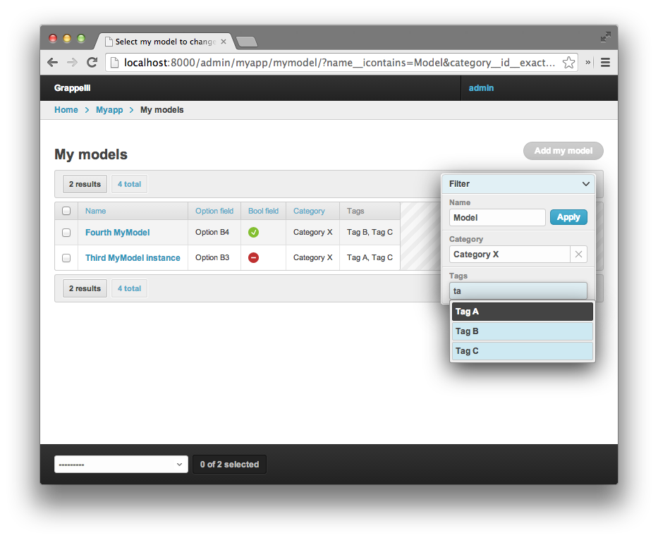

django-grappelli-filters
========================

Autocomplete filter for Grappelli

v 0.2 (usable, but only if you know why)

Filter for Foreign key and ManyToMany relations with AJAX autocomplete.
Reuses features from Grappelli, works nicely along other filters and
with both standard and sidebar filter template…

Installation
------------

Put ``grappelli-filters`` in your ``PYTHONPATH``.

Add ``'grappelli-filters'`` to ``INSTALLED_APPS``

Filters
-------

Related Autocomplete Filter
~~~~~~~~~~~~~~~~~~~~~~~~~~~

This filter is similar to a regular foreign key field filter, with two
differences:

-  it has a nice AJAX-powered autocomplete UI (straight from Grappelli)
-  does not load all possible filter values in HTML - good for
   situations with many of related objects

Usage
'''''

Configure Grappelli autocomplete feature as described `here`_. Both
Model method and ``SETTINGS`` value will work fine. For the inpatient,
here is the ``SETTINGS`` value:

::

    GRAPPELLI_AUTOCOMPLETE_SEARCH_FIELDS = {
        "myapp": {
            "mycategory": ("id__iexact", "name__icontains",),
        }
    }

In ``admin.py`` add:

::

    from grappelli_filters import RelatedAutocompleteFilter, FiltersMixin

    class MyModelAdmin(FiltersMixin, admin.ModelAdmin):
        list_filter = ( ... ('field_name', RelatedAutocompleteFilter), ... )
        

Search Filter
~~~~~~~~~~~~~

This filter allows string searches over a single field. Several filters
combined provide better control over the resulting list then does the
built-in django-admin ``search_fields`` feature.

Usage
'''''

In admin.py add:

::

    from grappelli_filters SearchFilter

    class MyModelAdmin(admin.ModelAdmin):
        list_filter = ( ... ('field_name', SearchFilter), ... )
        

Case-sensitive Search Filter
~~~~~~~~~~~~~~~~~~~~~~~~~~~~

Similar to Search Filter, but searches are case-sensitive.

Usage
'''''

Use ``SearchFilterC`` instead of ``SearchFilter``

.. _here: https://django-grappelli.readthedocs.org/en/latest/customization.html#autocomplete-lookups